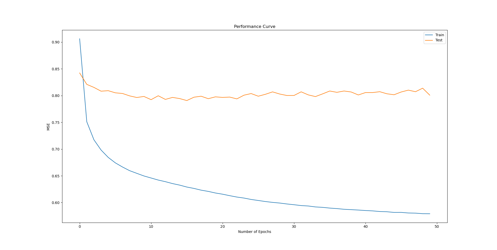

# Movie Recommender System

Implementation of a movie recommendation system using the [MovieLens dataset](https://grouplens.org/datasets/movielens/) based on 4 models -
 
1. Item-rating correlation based

Finds similar movies to given movie based on highest Pearson correlation scores between ratings of different movies. Read more about it [here](https://medium.com/coinmonks/how-recommender-systems-works-python-code-850a770a656b)

2. Content-metadata similarity based

Uses genres of movies and associated tags to create metadata for each movie, which is then passed through Tf-idf Vectorizer to generate embedding vectors. Then cosine similarity metric is used to find most similar movies to given movie. Read more about it [here](https://towardsdatascience.com/how-to-build-a-simple-movie-recommender-system-with-tags-b9ab5cb3b616) 

3. Collaborative filtering matrix-factorization model-based

Generates recommended movies for users based on previous ratings of movies (defined in the 'ratings' and 'user_ratings' files). Creates a user-movie rating matrix and decomposes it using scipy's sparse SVD then multiplies the decomposed matrices back together to generate the predicted ratings for each user. Movies with highest predicted ratings are recommended for a particular user. Read more about it [here](https://heartbeat.fritz.ai/recommender-systems-with-python-part-iii-collaborative-filtering-singular-value-decomposition-5b5dcb3f242b)

4. Deep-learning user-movie embedding based

Generates recommended movies for users based on previous ratings of movies (defined in the 'ratings' and 'user_ratings' files). Creates an n-dimensional embedding for each user and movie and then uses 2 fully connected layers to predict the rating for given movie. Movies with highest predicted ratings are recommended for a particular user. Read more about it [here](https://towardsdatascience.com/recommendation-system-series-part-2-the-10-categories-of-deep-recommendation-systems-that-189d60287b58)  

## Dataset

The 'MovieLens Latest: Small version' dataset has been used. It consists of the following files - links.csv, movies.csv, ratings.csv and tags.csv. There are a total of 1,00,836 ratings given by 610 users to a database of 9,742 movies. user_ratings.csv contains additional ratings from different users and is not part of the MovieLens dataset. 

## Generating Recommendations

Use main.py file and run the module on your system. The requirements for running the system have been explicitly stated in requirements.txt. If any of the modules stated are missing, open Command Prompt and type 'pip install <module-name>' to install it.

 For item-based recommendations, enter the movie's name as it appears in the dataset, and number of recommendations needed.

 For rating-based recommendations, before running the module, add your ratings in the excel file 'user_ratings.csv' in the format specified. UserId's from 1 to 610 belong in the MovieLens dataset under 'ratings.csv' so please refrain from using those to avoid conflict. Then run the module and enter User ID you want to generate recommendations for, and the number of recommendations.

## Performance

There is no training required for item-based models.

 For matrix factorization model, we computed root mean squared error for different values of k (the number of latent factors in sparse svd) and obtained the following curve -

The error drops steeply as k is increased meaning closer predictions however since most of the entries in ratings matrix are 0, the model starts overfitting at higher values of k and fails to pick up on movie features and tastes of users. The model gives most realistic recommendations at k=40 where RMSE is around 2.1 (neither too high nor too low).

For deep learning model, the learning curve for mean squared error loss vs number of epochs trained is as follows -

The batch size used is 64, and optimizer set to Adam with a learning rate of 0.001. From the curve it is pretty much clear that the elbow of the training curve occurs at around the 5th epoch and the test loss saturates at around the 10th with a minimum value of 0.79, which is pretty close to 'State Of The Art' for this dataset. However, to reduce overfitting to the test set number of epochs have been chosen to be 5. The model architecture is -

1. Embedding Layer - 50-dimensional embeddings for both users as well as movies.
2. Dense Hidden Layer - Size 10, ReLU activation with He-initialization.
3. Dense Output Layer - Size 1, Sigmoid activation with He-initialization. 

The output is then rescaled to produce the final predicted rating for user on the given movie.